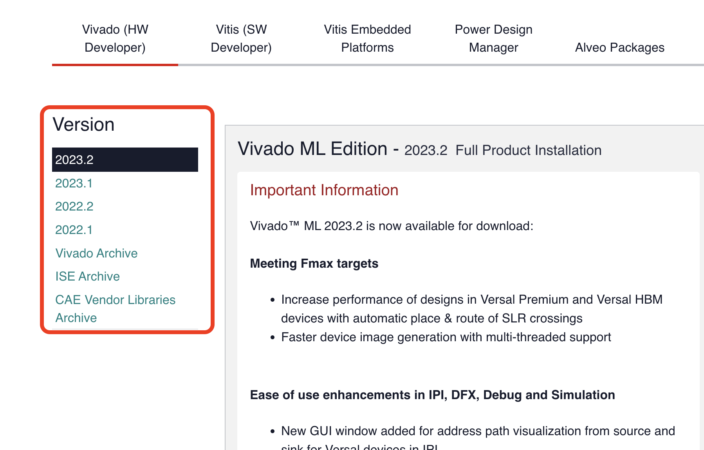
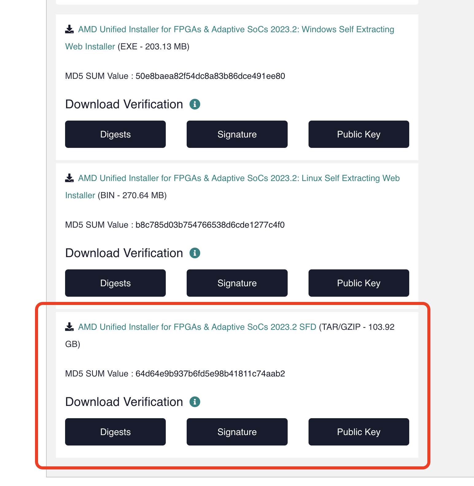
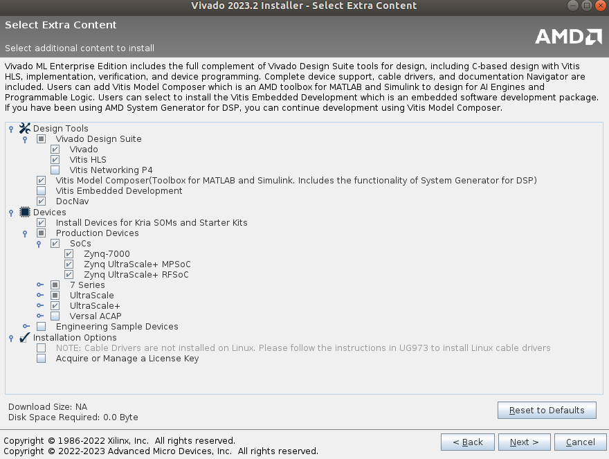

# Vivado Installation and Licensing

Vivado is one of the most widely used acedemic tools for hardware and hardware-related development projects. Contributing factors are its standard IP component library and support for a wide variety of boards which is both customisable and constanatly updated by the Xilinx Community. The licencing is generally free and should support most of the boards with some case-by-case limitaions.

In this tutorial our aim is to setup the Vivado environment for RFSoC projects and the corresponding licences. Here we set out to install the latest version of the Vivado for Linux systems. Addtional links for the Windows systems and its configurations are added below. 

## DOWNLOAD

**Login to your Xilinx account or create one using the NYU email. A free account is nneded to download the software**

* Open the [Xilinx Vivado Download](https://www.xilinx.com/support/download.html) page. Select the version of choice, depending on any specific needs, we went with the latest one.

<p align="center">

</p>

Now you could either choose to download the installer and then let it handle all the file dowloads and installation or download the tar.zip file unpack it and then install it. We had some isssues with the former approach so we chose the later one. 
* Select the required pacakage and it will lead you to a form, fill you details there and click on download.It will download the Xilinx_Unified_2020.2_1118_1232.tar.gz file.

<p align="center">

</p>

* Navigate to downloads folder on the Linux system and extract the files from the Xilinx_Unified_2020.2_1118_1232.tar.gz archive: 
```
tar -xvf Xilinx_Unified_2020.2_1118_1232.tar.gz
```

Run the installer: 
```
sudo ./xsetup
```
## INSTALLER OPTIONS
* Enter your Xilinx account information, and select Download and Install Now.
* On the Select Product to Install screen, choose Vivado ML Enterprise edition as the stabdard edition doesnt support the RFSoCs.
* On the customization screen, uncheck anything if required, except make sure you have the RFSoC files installed as shown in the pic.

<p align="center">

</p>

* Install Cable Drivers
```
cd /tools/Xilinx/Vivado/2020.2/data/xicom/cable_drivers/lin64/install_script/install_drivers
sudo ./install_drivers
```

* On the next screen, agree to all boxes.
* On the next screen, choose an installation location with enough space.
* On the next screen, click Install and wait a while.

## Opening the Vivado 
Once the software isinstalled it can be accessed with normal user prevelages as follows:
```
source /tools/Xilinx/Vivado/2023.2/settings64.sh
vivado
```

**Note:** But for making any installation changes to the software or any liscnece changes open/access the vivado with root prevelages as follows:
```
sudo -s
source /tools/Xilinx/Vivado/2023.2/settings64.sh
vivado
```
  
## License generation and updating

The license file for the Vivado should be automatically added. If the licence expires for you want to add some other licences, it can be either using the Vivado License manger interface or the Linux terminal.

**Generating a Node Locked Licence**

For adding anew liscence or updating an existing one, you need to first generate a new one from you Xilinx account. Open this [Licencing page](https://www.xilinx.com/member/forms/license-form.html) and login to you account if promted and fill out the details as before and click on Next.


----image need to added here ----

* Here check the Vivado ML edition liscnece and click on the **Genrate Node-Locked Licence**
* select/enter the MAC address of the system where you have installed the sowftware and click on Next.
* Confirm the detials of the licence and then click on next.

The licence file will be emailed to your NYU email address - or another email used to create the account

**Vivado Licence Manager**

For making any changes to software make sure to open Vivado with root prevelages as stated above. 

* Navigate to the **Help** section in the toolbar on the top and then click on **Manage Licence**.
* Now download the Xlinix licence file from the email on to your local machine.
* 
